# Workflow: Cargar 200 Videojuegos en Qdrant

Este repositorio contiene un workflow de n8n diseñado para extraer, transformar y cargar datos de 200 videojuegos en una base de datos vectorial Qdrant a través de procesos automatizados de ETL (Extract, Transform, Load) para IA.

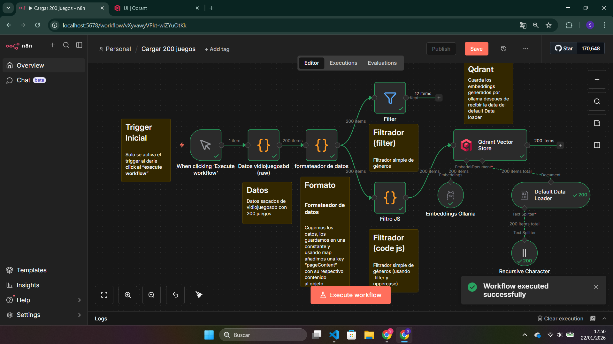

## 📖 Explicación General

El workflow automatiza el ciclo de vida completo de la preparación de datos para un sistema RAG (Retrieval-Augmented Generation). Extrae una lista de 200 videojuegos, les aplica un filtrado por género **(bonus)**, limpia y estructura los datos en un formato compatible con bases de datos vectoriales, genera embeddings de alta dimensionalidad (768) y finalmente los persiste en Qdrant.

## 🛠 Requisitos

Para poner en marcha este workflow, se necesitan los siguientes componentes:

### 1. Inteligencia Artificial (Embeddings)

- **Ollama**: Instalado localmente para ejecutar el modelo de embeddings.
- **Modelo**: Se requiere un modelo que genere vectores de 768 dimensiones (ej. `nomic-embed-text` o similar).
  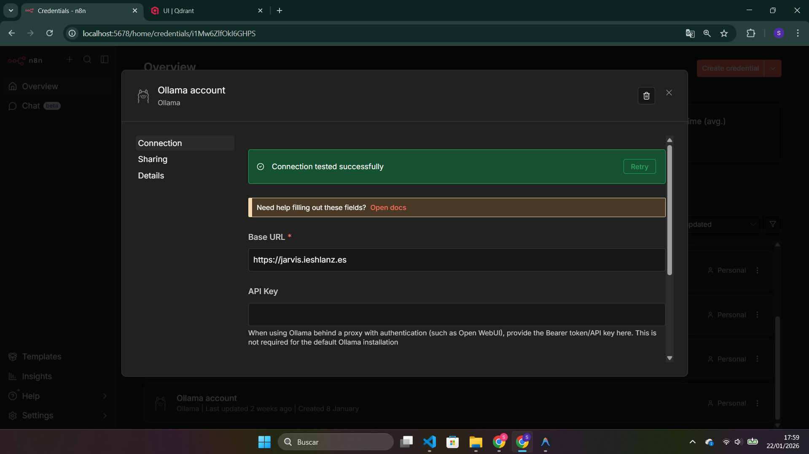

  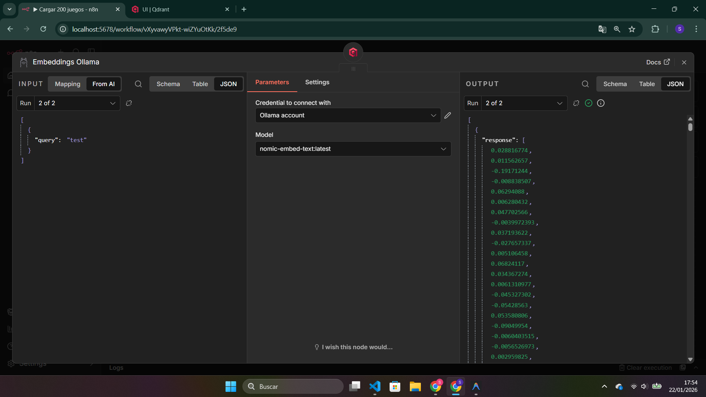

### 2. Base de Datos Vectorial

- **Qdrant**: Una instancia de Qdrant (local en Docker o Cloud).
- **Colección**: Una colección configurada para recibir vectores de 768 dimensiones.
  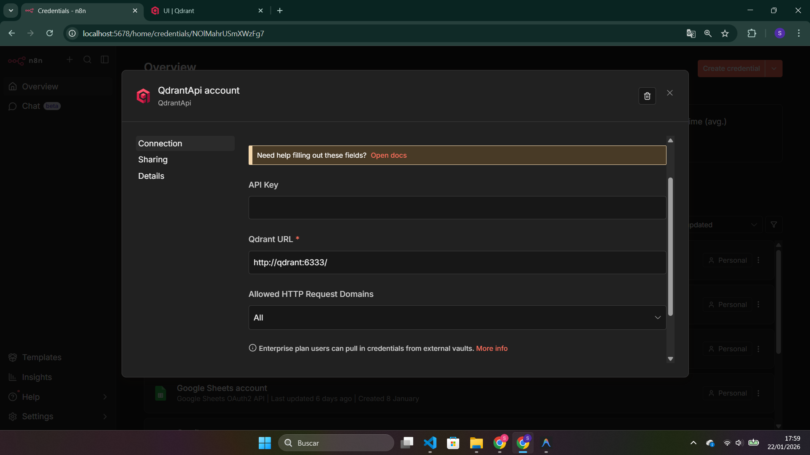
  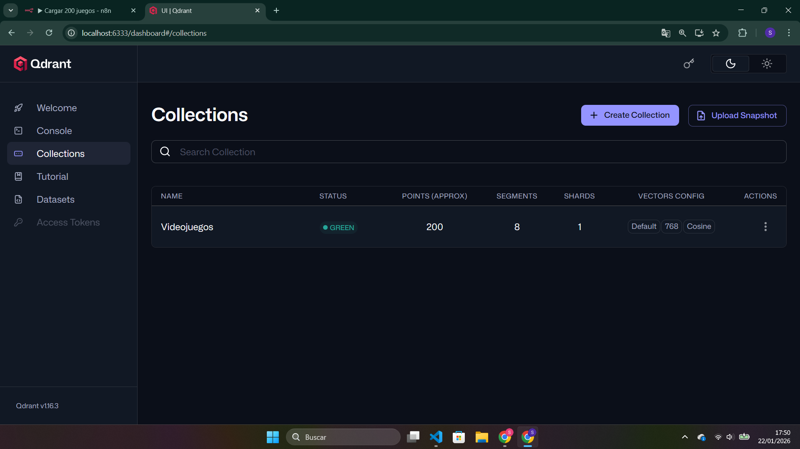

### 3. n8n

- Instancia de n8n con las credenciales configuradas para Ollama y Qdrant.

---

## ✅ Criterios de Evaluación

- [x] **Funcionalidad Completa (40%)**: El workflow ejecuta sin errores y carga todos los 200 videojuegos en Qdrant.
- [x] **Transformación de Datos (30%)**: Los datos se transforman correctamente: `pageContent` + `metadata` bien estructurados.
- [x] **Embeddings Correctos (20%)**: Los vectores de 768 dimensiones se generan y guardan en Qdrant.
- [x] **Documentación (10%)**: El workflow tiene nombres claros en nodos y lógica comprensible.

## 🚀 Puntos Adicionales Bonus

- [x] **Filtrado por Género**: Crear un segundo nodo Code que filtre solo juegos de un género específico.
- [x] **Error Handling**: Implementar error handling (try-catch) en los nodos Code.
- [ ] **Logging**: Añadir logging para debug durante la ejecución.
- [x] **Notas de Documentación**: Documentar el workflow con notas en cada nodo explicando su función.

---

## 🔍 Explicación Paso a Paso de los Nodos

### 1. Carga de Datos (Extract)

Se inicia con la recuperación de los 200 registros de videojuegos.

- **Nodo: DatosRaw / DfDataLoader**: Se encarga de la extracción inicial del CSV o fuente de datos.
  
  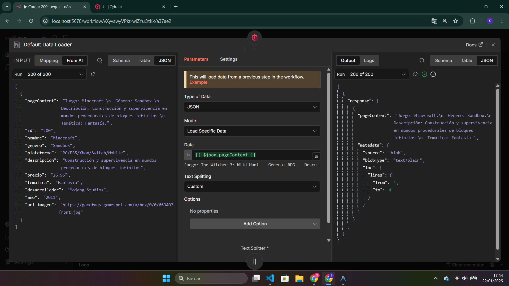
- **Manejo de Errores**: Se implementa un bloque Try-Catch para asegurar que si la carga falla, el flujo se gestione correctamente.
  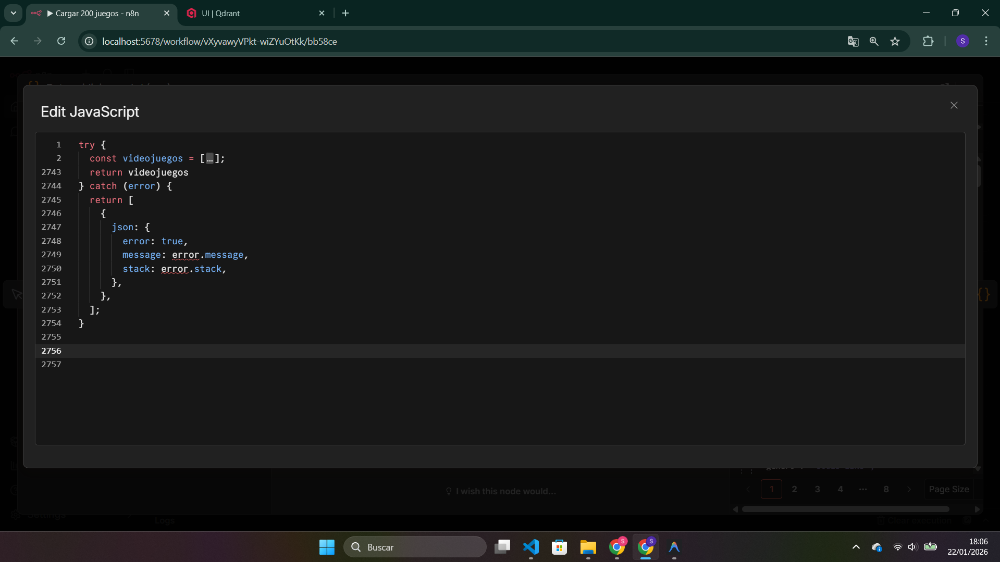

### 2. Transformación y Formateo

Preparación del contenido para ser vectorizado.

- **Formateador de Datos JS**: Estructura cada item en los campos requeridos por Qdrant: un `pageContent` descriptivo y un objeto de `metadata` con campos como nombre, género, año, etc.
  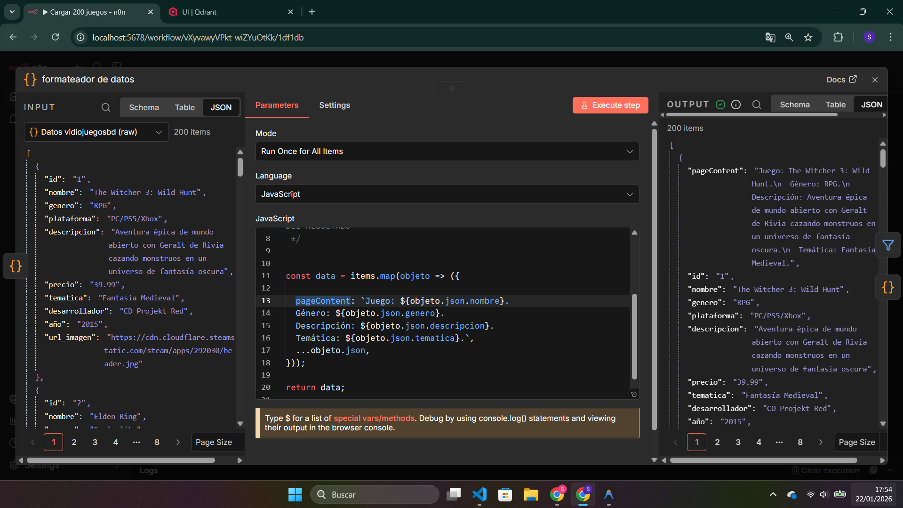
  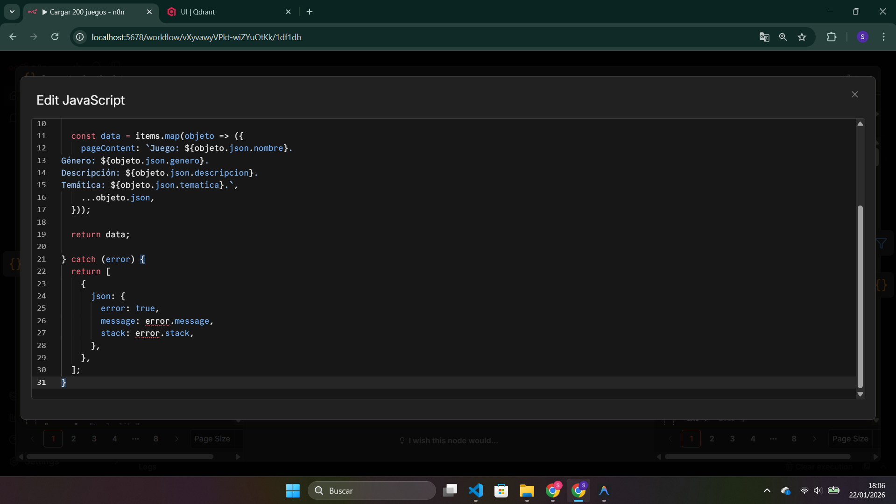

### 3. Filtrado de Datos

- **Filtro Normal**: Aplicamos un filtro por género (ej. Action, RPG) para cumplir con el bonus.
  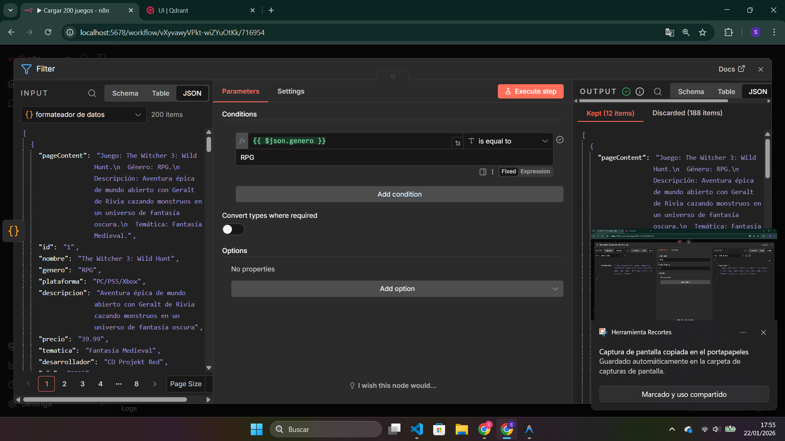
- **Filtro JS (Code)**: Implementación personalizada mediante JavaScript para un filtrado más robusto.
  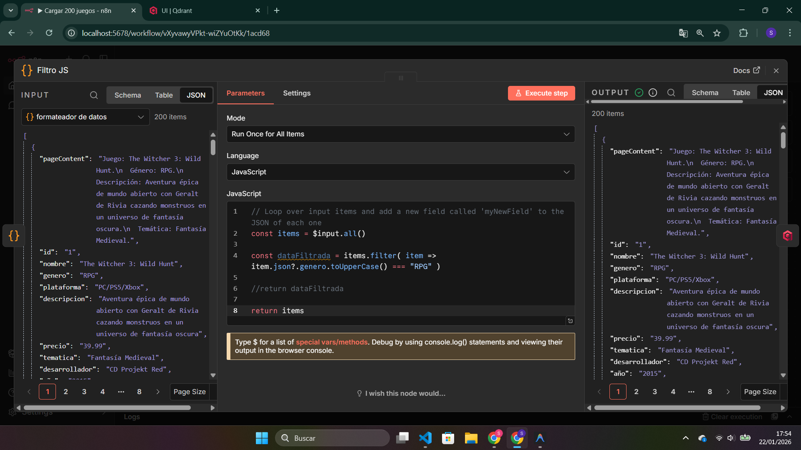
- **Manejo de Errores**: Control de excepciones en la lógica de filtrado.
  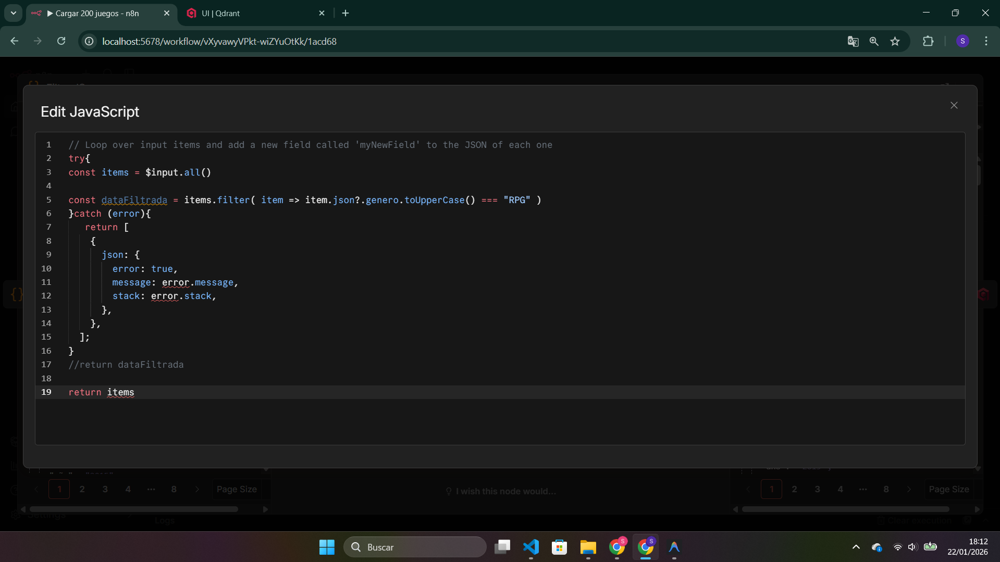

### 4. Segmentación de Texto (Chunking)

- **Text Splitter**: Divide el contenido formateado en fragmentos manejables para optimizar la precisión de los embeddings.
  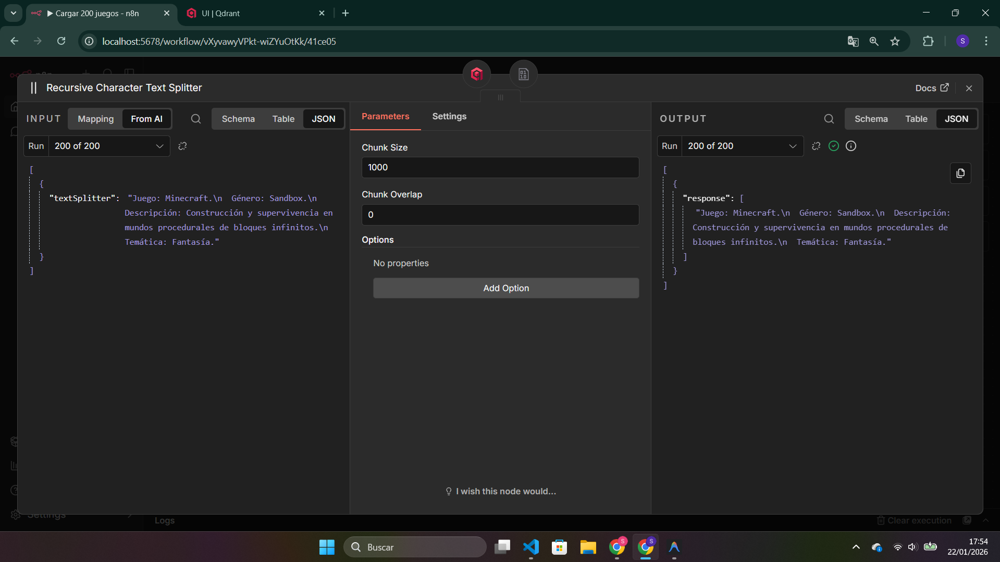

### 5. Generación de Embeddings

- **Embeddings Ollama**: Envía el texto al modelo local de Ollama para convertir el lenguaje natural en vectores numéricos de 768 dimensiones.
  

### 6. Carga Vectorial (Load)

- **Qdrant Node**: Los vectores resultantes, junto con sus metadatos, se insertan en la colección de Qdrant.
  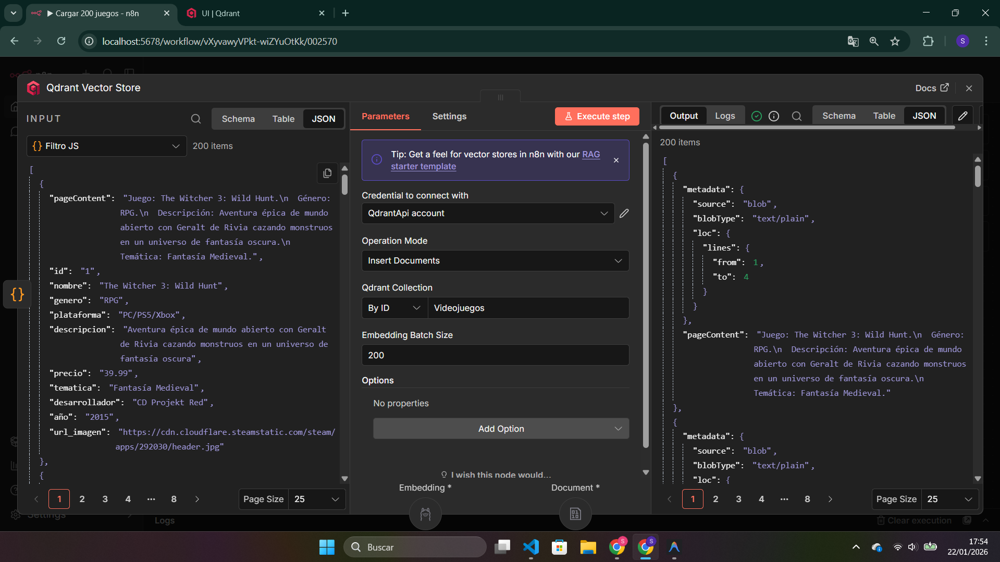

---

## Checklist:
- [x] **Funcionalidad Completa (40%)**: El workflow ejecuta sin errores y carga todos los 200 videojuegos en Qdrant.
- [x] **Transformación de Datos (30%)**: Los datos se transforman correctamente: `pageContent` + `metadata` bien estructurados.
- [x] **Embeddings Correctos (20%)**: Los vectores de 768 dimensiones se generan y guardan en Qdrant.
- [x] **Documentación (10%)**: El workflow tiene nombres claros en nodos y lógica comprensible.

### Bonus:
- [x] **Filtrado por Género**: Crear un segundo nodo Code que filtre solo juegos de un género específico.
- [x] **Error Handling**: Implementar error handling (try-catch) en los nodos Code.
- [ ] **Logging**: Añadir logging para debug durante la ejecución.
- [x] **Notas de Documentación**: Documentar el workflow con notas en cada nodo explicando su función.